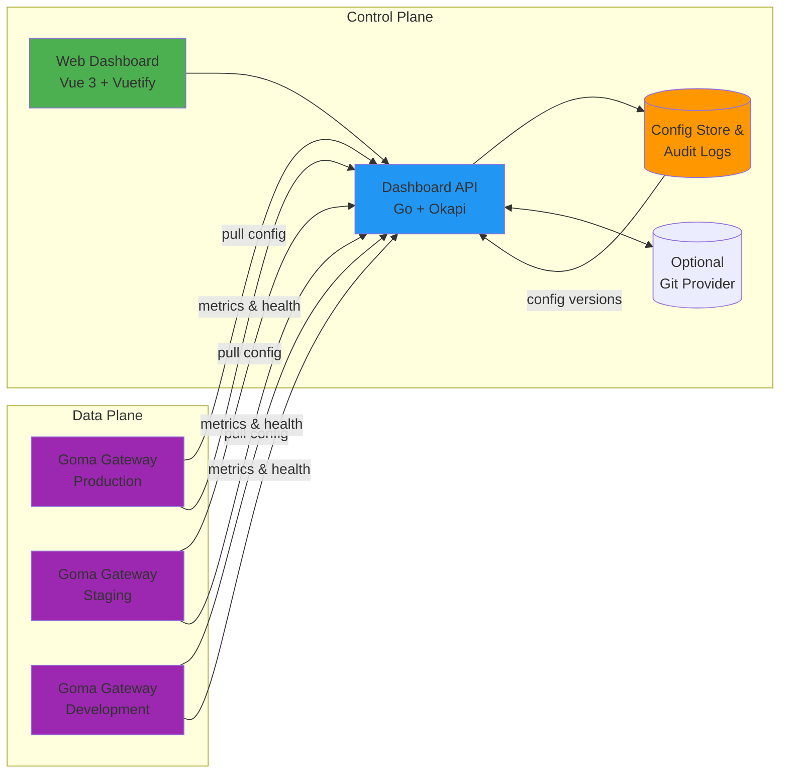

# Goma Admin

A comprehensive admin dashboard for managing Goma Gateway instances with visual configuration, real-time monitoring, and multi-environment support.

[](LICENSE)
[](go.mod)
[](package.json)

> **⚠️ Development Status**: This project is currently under active development. Contributions and feedback are welcome!

## Table of Contents

- [Overview](#overview)
- [Features](#features)
- [Architecture](#architecture)
- [Tech Stack](#tech-stack)
- [Getting Started](#getting-started)
- [API Reference](#api-reference)
- [Contributing](#contributing)
- [Related Projects](#related-projects)

## Overview

Goma Admin provides a centralized control plane for managing multiple Goma Gateway instances across different environments. It implements the [Goma Gateway HTTP Provider specification](https://github.com/jkaninda/goma-http-provider) to dynamically configure routes, middlewares, and monitor gateway health.

**Key Benefits:**
- Centralized configuration management for multiple gateway instances
- Visual interface for route and middleware configuration
- Real-time monitoring and analytics
- Configuration versioning with rollback capabilities
- Multi-environment support (dev, staging, production)

## Features

### Configuration Management
-  Visual route management with full CRUD operations
-  Middleware configuration interface
-  Configuration preview and validation
-  Version history and rollback capabilities
-  Optional Git integration for configuration versioning

### Monitoring & Analytics
-  Real-time gateway status monitoring
-  Prometheus metrics visualization
-  API analytics and request monitoring
-  Advanced search and filtering
-  Comprehensive log viewer

### Operations
-  Health checks and uptime monitoring
-  Request/response testing tool
-  Multi-instance support across environments
-  Hot-reload configuration updates

## Architecture


### Components

**Control Plane:**
- **Web Dashboard**: Vue3 based UI for configuration and monitoring
- **Dashboard API**: Go backend built with Okapi framework
- **Config Store**: Persistent storage for configurations and audit logs
- **Git Integration** (Optional): Version control for configurations

**Data Plane:**
- **Goma Gateway Instances**: Multiple gateway instances pulling configuration from the control plane

## Tech Stack

### Frontend
- **Framework**: Vue 3 with Composition API
- **Build Tool**: Vite
- **UI Library**: Vuetify 3 or PrimeVue
- **State Management**: Pinia
- **HTTP Client**: Axios

### Backend
- **Language**: Go
- **Framework**: [Okapi](https://github.com/jkaninda/okapi)
- **Database**: PostgreSQL (recommended) or SQLite
- **Metrics**: Prometheus-compatible

## Getting Started

### Prerequisites

- Go 1.21 or higher
- Node.js 18+ and npm/yarn
- PostgreSQL 13+ (or SQLite for development)
- Docker and Docker Compose (optional)

### Installation
```bash
# Clone the repository
git clone https://github.com/jkaninda/goma-admin.git
cd goma-admin

# Backend setup

cp .env.example .env
go run main.go

```

### Configuration


## API Reference

### Provider API
Implements the [Goma Gateway HTTP Provider Specification](https://github.com/jkaninda/goma-http-provider)
```
GET  /api/provider              # Combined routes and middlewares
GET  /api/provider/routes       # Routes configuration
GET  /api/provider/middlewares  # Middlewares configuration
POST /api/provider/webhook      # Gateway health updates
```

### Admin API
Management interface for the dashboard

#### Routes Management
```
GET    /api/v1/routes           # List all routes
POST   /api/v1/routes           # Create new route
GET    /api/v1/routes/:id       # Get route details
PUT    /api/v1/routes/:id       # Update route
DELETE /api/v1/routes/:id       # Delete route
```

#### Middlewares Management
```
GET    /api/v1/middlewares      # List all middlewares
POST   /api/v1/middlewares      # Create middleware
GET    /api/v1/middlewares/:id  # Get middleware details
PUT    /api/v1/middlewares/:id  # Update middleware
DELETE /api/v1/middlewares/:id  # Delete middleware
```

#### Gateway Instances
```
GET    /api/v1/instances              # List gateway instances
POST   /api/v1/instances              # Register new instance
GET    /api/v1/instances/:id          # Get instance details
PUT    /api/v1/instances/:id          # Update instance
DELETE /api/v1/instances/:id          # Remove instance
GET    /api/v1/instances/:id/health   # Instance health status
GET    /api/v1/instances/:id/metrics  # Prometheus metrics
```

#### Configuration History
```
GET    /api/v1/config/history          # List configuration versions
POST   /api/v1/config/rollback/:version # Rollback to specific version
GET    /api/v1/config/diff/:v1/:v2     # Compare configurations
```

#### Analytics & Monitoring
```
GET    /api/v1/analytics/overview    # Dashboard overview
GET    /api/v1/analytics/requests    # Request statistics
GET    /api/v1/analytics/errors      # Error tracking
GET    /api/v1/logs                  # Gateway logs
```

#### Testing
```
POST   /api/v1/test/route            # Test route configuration
POST   /api/v1/test/middleware       # Test middleware
POST   /api/v1/validate/config       # Validate configuration
```

For detailed API documentation, see [API.md](docs/API.md).

## Contributing

Contributions are welcome! This project is in active development and needs help with:

- UI/UX improvements
- Test coverage
- Documentation
- Bug fixes
- New features

Please read [CONTRIBUTING.md](CONTRIBUTING.md) for details on our code of conduct and the process for submitting pull requests.

## Related Projects

- **[Goma Gateway](https://github.com/jkaninda/goma-gateway)** - Cloud-native API Gateway
- **[Goma HTTP Provider](https://github.com/jkaninda/goma-http-provider)** - HTTP provider specification
- **[Okapi](https://github.com/jkaninda/okapi)** - Go web framework

## Roadmap

- [ ] Complete core CRUD operations
- [ ] Implement real-time metrics dashboard
- [ ] Add authentication and authorization
- [ ] Git-based configuration versioning
- [ ] WebSocket support for live updates
- [ ] Multi-user collaboration features
- [ ] CI/CD pipeline integration
- [ ] Helm charts for Kubernetes deployment

## License

This project is licensed under the MIT License - see the [LICENSE](LICENSE) file for details.

## Support

- Email: meAtjkaninda.com
- LinkedIn: [LinkedIn](https://www.linkedin.com/in/jkaninda)

---

**Made with ❤️ by [Jonas Kaninda](https://github.com/jkaninda)**